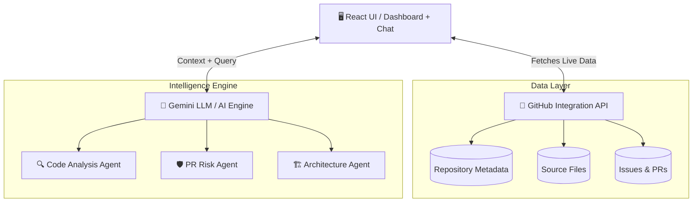
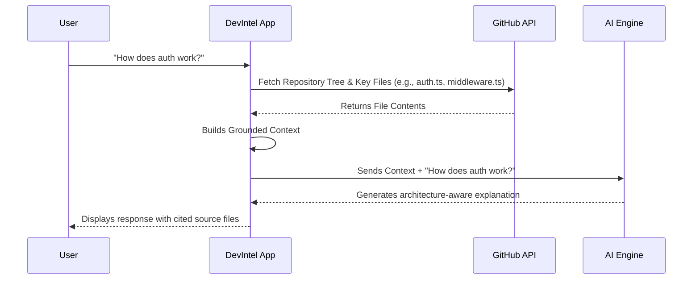
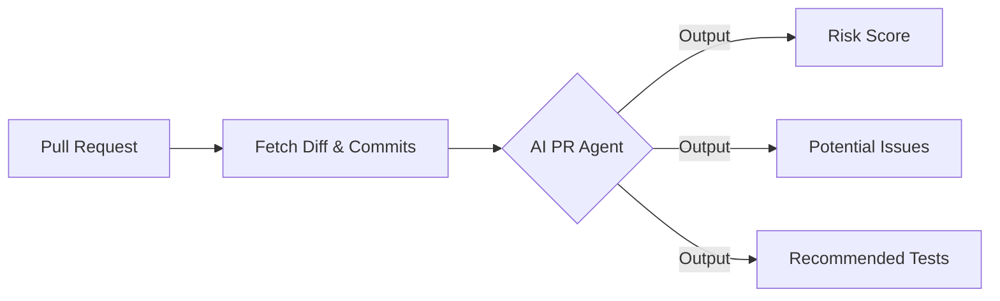

<div align="center">
  
# 🧠 DevIntel AI

**An AI engineering teammate that understands your GitHub repository, codebase, issues, pull requests, and development history.**

[](https://github.com/khushigoyal771/DevIntel-AI/actions/workflows/deploy.yml)
[](#)
[](#)
[](#)
[](#)

</div>

---

## 🚀 What is DevIntel AI?

The goal is not to make “another chatbot.” DevIntel AI is a **developer intelligence platform** designed to act as a senior engineering teammate. By connecting directly to a GitHub repository, DevIntel analyzes the source code, commits, issues, and pull requests to build a contextual understanding of the software's architecture and engineering health.

You can ask:
> “Where is authentication implemented?”
> “Summarize the last 10 PRs and identify risks.”
> “What could break if I modify this function?”

---

## 🧠 Core Architecture

DevIntel AI uses a modern serverless approach, bringing powerful API integrations directly to the client side.



---

## ⚙️ How it Works: RAG-based Code Intelligence

Instead of blindly sending code to an LLM, DevIntel intelligently builds context.



---

## 🌟 Key Features

### 1. 📊 Repository Health Score
Analyzes and aggregates key repository metrics into a holistic health score, giving you an immediate sense of the project's state.

### 2. 🤖 Agentic Reasoning
Utilizes specialized AI agents to process different parts of the repository:
- **Code Analysis Agent**: Looks for bugs and complex logic.
- **PR Agent**: Analyzes code changes for regressions.

### 3. 🛡️ PR Intelligence & Risk Scoring
Click on any Pull Request to generate an instant AI Code Review. 


### 4. 💬 "Ask Your Repository"
A context-aware chat interface. The AI knows what repository you are looking at and fetches necessary files to ground its answers in reality.

---

## 🛠️ Tech Stack

- **Frontend**: React 18, TypeScript, Vite
- **Styling**: Tailwind CSS, Framer Motion (for animations), Lucide Icons
- **Data Visualization**: Recharts
- **Integrations**: Octokit (GitHub REST API), Google Generative AI SDK (Gemini)
- **Deployment**: GitHub Pages (Serverless CI/CD via GitHub Actions)

---

## 💻 Local Development Setup

To run DevIntel AI locally on your machine:

1. **Clone the repository**
   ```bash
   git clone https://github.com/khushigoyal771/DevIntel-AI.git
   cd DevIntel-AI
   ```

2. **Install Dependencies**
   ```bash
   npm install
   ```

3. **Start the Development Server**
   ```bash
   npm run dev
   ```
   Open `http://localhost:5173` in your browser.

4. *(Optional)* **Add API Keys**
   - Click on the **Settings** tab in the app to add your GitHub Personal Access Token (for higher rate limits) and your Google Gemini API Key (for real AI responses).

---

<div align="center">
  <i>Built to bridge the gap between Software Engineering and AI.</i>
</div>
